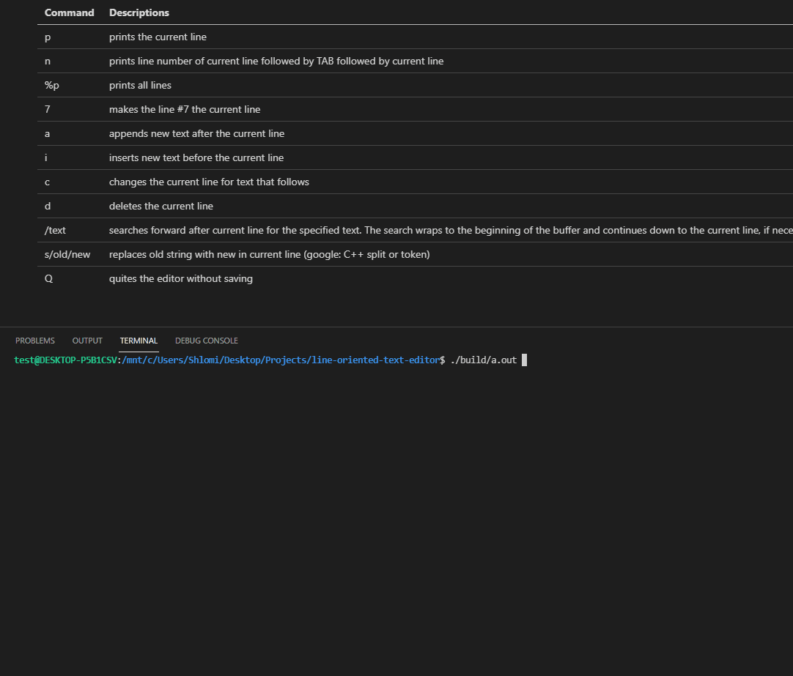

# About

This is a command-line based text editor. Just like 'vi'.

# Commands

| Command   | Descriptions                                                                                                                                                     |
| --------- | ---------------------------------------------------------------------------------------------------------------------------------------------------------------- |
| p         | prints the current line                                                                                                                                          |
| n         | prints line number of current line followed by TAB followed by current line                                                                                      |
| %p        | prints all lines                                                                                                                                                 |
| 7         | makes the line #7 the current line                                                                                                                               |
| a         | appends new text after the current line                                                                                                                          |
| i         | inserts new text before the current line                                                                                                                         |
| c         | changes the current line for text that follows                                                                                                                   |
| d         | deletes the current line                                                                                                                                         |
| /text     | searches forward after current line for the specified text. The search wraps to the beginning of the buffer and continues down to the current line, if necessary |
| s/old/new | replaces old string with new in current line (google: C++ split or token)                                                                                        |
| Q         | quites the editor without saving                                                                                                                                 |

# How to create basic file

# How to run / test

To run an example:

`$ ./build/a.out < test/test_main_input.txt `

To run interactivly:

`$ make `

Or just run `a.out`.

To run tests:

`$ make run_tests `
